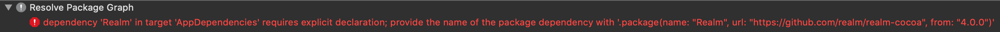
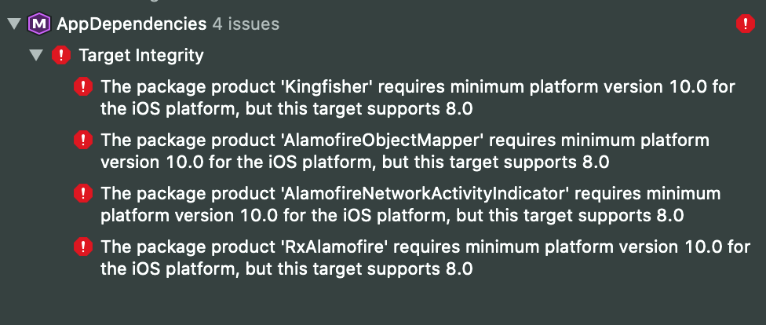

# CartfileToPackage.swift

Easily migrate from Carthage (this was a great) to Swift Package Manager

Xcode has integrated SPM, but if you have many dependencies, it can take long to add them to your project

TL;DR :
```
git clone https://github.com/openium/CartfileToPackage.swift
cd CartfileToPackage.swift
swift run CartfileToPackageSwift ~/source-cache/your-project/Cartfile ~/source-cache/your-project/AppDependencies
echo "drag-and-drop AppDependencies in your folder, xcode will resolve packages (and print 'xyz has no Package.swift manifest', up to you"
```

### What does this project do :

- Generate a swift package with no code with dependecies based on the Cartfile and the PackageName you give

### What does this project do NOT do :

- Check / validate / knows if a dependency is SPM compatible (fork it and make PR if no one else already done one)

### What you have to do after the Package has been created :

- Drag & drop it to your project/workspace, and add the library to the linked ones of your target(s)

### Bonus :

- You can split your Cartfile into multiple ones to have one Package per target (AppDependencies & TestDependencies for example) 

### At the end your projet will be like this :


### Common Issues of dependencies

- Not SPM compatible yet:


To fix this : check if a PR already ask for SPM support on this project, or make one (looking at `Package.swift` files of other projects can help)

- Product not found: project repo / product mismatch (because we assume last path component of repo URL is library name):


To fix this : rename the target name to the correct one, and this error will appear:



To fix this : add `name: "CorrectProductName", ` to the `.package(` line

- At link time, some module could be missing (a project can have multiple modules), and they can come from missing "sub-dependencies" package:


To fix this : add `.product(name: "RxCocoaRuntime", package: "RxSwift"), ` to the `targets: [` 
Note: you might also add a missing package if this product is in a , in this case : `.package(url: "https://github.com/ReactiveX/RxSwift", .upToNextMajor(from: "5.0.0")),`

- And finally got nice errors that Carthage can't show to you:




Some references :

https://github.com/renaudjenny/Swift-Package-Manager-Static-Dynamic-Xcode-Bug
